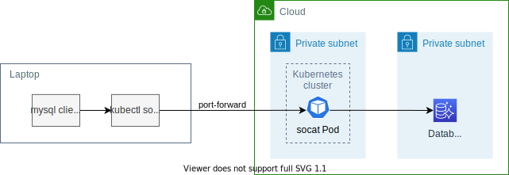

# kubectl-external-forward [](https://github.com/int128/kubectl-external-forward/actions/workflows/go.yaml)

This is a kubectl plugin to connect to an external host from your laptop via a cluster.

For example, you can run your application locally using remote databases.




## Why

This plugin allows you to connect to a host outside of a cluster.
It is useful when a host is in a **private network** and **unreachable** from your laptop.
`kubectl port-forward` only allows you to connect to a pod inside a cluster.

This plugin provides TCP proxy.
Just run your application with localhost configuration, like connecting to MySQL on your laptop.
No proxy configuration such as HTTP_PROXY or SOCKS is needed.

This is an alternative of SSH bastion.
You no longer maintain your bastion servers.


## Getting Started

### Setup

Install the latest release from [Homebrew](https://brew.sh/) or [GitHub Releases](https://github.com/int128/kubectl-external-forward/releases).

```sh
# Homebrew
brew install int128/tap/kubectl-external-forward

# Go 1.16+
go install github.com/int128/kubectl-external-forward/cmd/kubectl-external_forward
```

### Run

To connect to a host:

```console
% kubectl external-forward 10000:www.example.com:80
I0307 22:10:21.520991   76486 external_forwarder.go:52] creating a pod
I0307 22:10:21.586707   76486 external_forwarder.go:58] created pod default/socat-dkgm4
I0307 22:10:21.611300   76486 pod.go:57] pod default/socat-dkgm4 is still Pending
I0307 22:10:22.181070   76486 pod.go:57] pod default/socat-dkgm4 is still Pending
I0307 22:10:23.274268   76486 external_forwarder.go:106] starting port-forwarder from 10000 to default/socat-dkgm4:10000
I0307 22:10:23.335257   76486 pod.go:87] default/socat-dkgm4/tunnel1: 2021/03/07 13:10:23 socat[1] W ioctl(5, IOCTL_VM_SOCKETS_GET_LOCAL_CID, ...): Not a tty
I0307 22:10:23.336618   76486 pod.go:87] default/socat-dkgm4/tunnel1: 2021/03/07 13:10:23 socat[1] N listening on AF=2 0.0.0.0:10000
Forwarding from 127.0.0.1:10000 -> 10000
```

To connect to multiple hosts:

```console
% kubectl external-forward 15432:postgresql.staging:5432 13306:mysql.staging:3306
```

Press ctrl-c to gracefully stop the command and clean up the socat pod.


## Considerations

### Garbage collection of socat pod

This plugin provides an equivalent feature to the following commands:

```sh
kubectl run socat --rm --attach alpine/socat -- tcp-listen:13306,fork tcp-connect:mysql.staging:3306
kubectl port-forward socat 13306
# finally
kubectl delete pod socat
```

It finally deletes socat pod but eventually it may be remaining after stop.
It would be better to clean up socat pods periodically to prevent the resource leak.


### Docker Hub rate limit

By default, kubectl-external-forward creates a pod with image `ghcr.io/int128/kubectl-external-forward/mirror/alpine/socat:latest`.
It is mirrored from [Docker Hub](https://hub.docker.com/r/alpine/socat) to [GitHub Container Registry](https://ghcr.io/int128/kubectl-external-forward/mirror/alpine/socat) everyday in [this workflow](.github/workflows/socat.yaml).

You can still set your custom image but please note the rate limit of Docker Hub.


## Usage

```console
kubectl external-forward [flags] [LOCAL_HOST:]LOCAL_PORT:REMOTE_HOST:REMOTE_PORT...

Flags:
      --add_dir_header                   If true, adds the file directory to the header of the log messages
      --alsologtostderr                  log to standard error as well as files
      --as string                        Username to impersonate for the operation
      --as-group stringArray             Group to impersonate for the operation, this flag can be repeated to specify multiple groups.
      --cache-dir string                 Default cache directory (default "~/.kube/cache")
      --certificate-authority string     Path to a cert file for the certificate authority
      --client-certificate string        Path to a client certificate file for TLS
      --client-key string                Path to a client key file for TLS
      --cluster string                   The name of the kubeconfig cluster to use
      --context string                   The name of the kubeconfig context to use
  -h, --help                             help for kubectl
      --image string                     Pod image (default "ghcr.io/int128/kubectl-external-forward/mirror/alpine/socat:latest")
      --insecure-skip-tls-verify         If true, the server's certificate will not be checked for validity. This will make your HTTPS connections insecure
      --kubeconfig string                Path to the kubeconfig file to use for CLI requests.
  -l, --local-port int                   local port
      --log_backtrace_at traceLocation   when logging hits line file:N, emit a stack trace (default :0)
      --log_dir string                   If non-empty, write log files in this directory
      --log_file string                  If non-empty, use this log file
      --log_file_max_size uint           Defines the maximum size a log file can grow to. Unit is megabytes. If the value is 0, the maximum file size is unlimited. (default 1800)
      --logtostderr                      log to standard error instead of files (default true)
  -n, --namespace string                 If present, the namespace scope for this CLI request
      --one_output                       If true, only write logs to their native severity level (vs also writing to each lower severity level)
  -r, --remote-host string               remote host:port
      --request-timeout string           The length of time to wait before giving up on a single server request. Non-zero values should contain a corresponding time unit (e.g. 1s, 2m, 3h). A value of zero means don't timeout requests. (default "0")
  -s, --server string                    The address and port of the Kubernetes API server
      --skip_headers                     If true, avoid header prefixes in the log messages
      --skip_log_headers                 If true, avoid headers when opening log files
      --stderrthreshold severity         logs at or above this threshold go to stderr (default 2)
      --tls-server-name string           Server name to use for server certificate validation. If it is not provided, the hostname used to contact the server is used
      --token string                     Bearer token for authentication to the API server
      --user string                      The name of the kubeconfig user to use
  -v, --v Level                          number for the log level verbosity
      --version                          version for kubectl
      --vmodule moduleSpec               comma-separated list of pattern=N settings for file-filtered logging
```


## Contributions

This is an open source software licensed under Apache License 2.0. Feel free to open issues and pull requests for improving code and documents.
