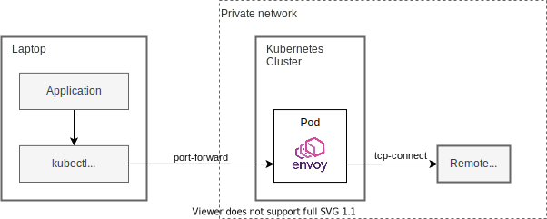

# kubectl-external-forward [](https://github.com/int128/kubectl-external-forward/actions/workflows/go.yaml)

This is a kubectl plugin to connect from your laptop to an external host via a proxy pod on a cluster.
It runs [Envoy Proxy](https://www.envoyproxy.io) in a pod and establishes port-forwarding from your laptop to a host outside the cluster.


## Why

This allows you to connect from your laptop to a host outside of a cluster.
It is useful when a host (such as database or API endpoint) is in a **private network** and **unreachable** from your laptop.
While `kubectl port-forward` connects to a pod inside a cluster, this connects to a host outside a cluster.

This plugin runs a TCP proxy pod on a cluster and set up a port-forwarder on your laptop.
You just run your application with localhost configuration as if a database is running on local.
No proxy configuration such as HTTP_PROXY or SOCKS is needed.

This is an alternative of SSH bastion.
You no longer maintain your bastion servers.


### Use case: run application on laptop using remote database

You can run your application on the local machine using the remote database.
For example, in our organization, everyday we copy the production database into another one for development.
It is useful for testing user experience using the production database.




## Getting Started

### Setup

Install the latest release from [Homebrew](https://brew.sh/) or [GitHub Releases](https://github.com/int128/kubectl-external-forward/releases).

```sh
# Homebrew
brew install int128/tap/kubectl-external-forward

# Go 1.16+
go install github.com/int128/kubectl-external-forward/cmd/kubectl-external_forward
```

### Run

To connect to a host:

```console
% kubectl external-forward 10080:www.example.com:80
I0406 10:40:42.734644   19125 external_forwarder.go:48] creating a pod
I0406 10:40:42.782034   19125 external_forwarder.go:57] created pod default/kubectl-external-forward-txbks
I0406 10:40:42.803104   19125 pod.go:67] pod default/kubectl-external-forward-txbks is still Pending
I0406 10:40:43.368883   19125 pod.go:67] pod default/kubectl-external-forward-txbks is still Pending
I0406 10:40:44.461645   19125 external_forwarder.go:105] starting port-forwarder from 10080 to default/kubectl-external-forward-txbks:10080
...
Forwarding from 127.0.0.1:10080 -> 10080
Handling connection for 10080
```

To connect to multiple hosts:

```sh
kubectl external-forward 15432:postgresql.staging:5432 13306:mysql.staging:3306
```

To listen on 0.0.0.0 (useful for Docker bridge):

```sh
kubectl external-forward 0.0.0.0:15432:postgresql.staging:5432
```

Press ctrl-c to stop the command gracefully. It will clean up the proxy pod.


## Considerations

### Garbage collection of pod

This plugin creates a pod running Envoy.
It finally deletes the pod but eventually it may be remaining after stopped.
It would be better to clean up the pods periodically to prevent the resource leak.


### Envoy image

By default, this plugin creates a pod with [the image on GitHub Container Registry](https://ghcr.io/int128/kubectl-external-forward/mirror/envoy), which is mirrored from [Docker Hub](https://hub.docker.com/r/alpine/socat) everyday in [this workflow](.github/workflows/socat.yaml).
It avoids the rate limit of Docker Hub in your environment.


## Usage

```console
kubectl external-forward [flags] [LOCAL_HOST:]LOCAL_PORT:REMOTE_HOST:REMOTE_PORT...

Flags:
      --add_dir_header                   If true, adds the file directory to the header of the log messages
      --alsologtostderr                  log to standard error as well as files
      --as string                        Username to impersonate for the operation
      --as-group stringArray             Group to impersonate for the operation, this flag can be repeated to specify multiple groups.
      --cache-dir string                 Default cache directory (default "~/.kube/cache")
      --certificate-authority string     Path to a cert file for the certificate authority
      --client-certificate string        Path to a client certificate file for TLS
      --client-key string                Path to a client key file for TLS
      --cluster string                   The name of the kubeconfig cluster to use
      --context string                   The name of the kubeconfig context to use
  -h, --help                             help for kubectl
      --image string                     Pod image (default "ghcr.io/int128/kubectl-external-forward/mirror/envoy")
      --insecure-skip-tls-verify         If true, the server's certificate will not be checked for validity. This will make your HTTPS connections insecure
      --kubeconfig string                Path to the kubeconfig file to use for CLI requests.
  -l, --local-port int                   local port
      --log_backtrace_at traceLocation   when logging hits line file:N, emit a stack trace (default :0)
      --log_dir string                   If non-empty, write log files in this directory
      --log_file string                  If non-empty, use this log file
      --log_file_max_size uint           Defines the maximum size a log file can grow to. Unit is megabytes. If the value is 0, the maximum file size is unlimited. (default 1800)
      --logtostderr                      log to standard error instead of files (default true)
  -n, --namespace string                 If present, the namespace scope for this CLI request
      --one_output                       If true, only write logs to their native severity level (vs also writing to each lower severity level)
  -r, --remote-host string               remote host:port
      --request-timeout string           The length of time to wait before giving up on a single server request. Non-zero values should contain a corresponding time unit (e.g. 1s, 2m, 3h). A value of zero means don't timeout requests. (default "0")
  -s, --server string                    The address and port of the Kubernetes API server
      --skip_headers                     If true, avoid header prefixes in the log messages
      --skip_log_headers                 If true, avoid headers when opening log files
      --stderrthreshold severity         logs at or above this threshold go to stderr (default 2)
      --tls-server-name string           Server name to use for server certificate validation. If it is not provided, the hostname used to contact the server is used
      --token string                     Bearer token for authentication to the API server
      --user string                      The name of the kubeconfig user to use
  -v, --v Level                          number for the log level verbosity
      --version                          version for kubectl
      --vmodule moduleSpec               comma-separated list of pattern=N settings for file-filtered logging
```


## Contributions

This is an open source software licensed under Apache License 2.0. Feel free to open issues and pull requests for improving code and documents.
